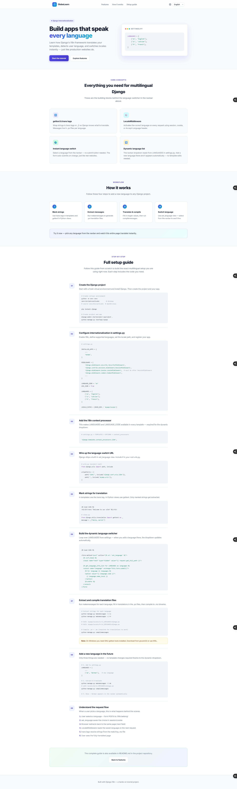
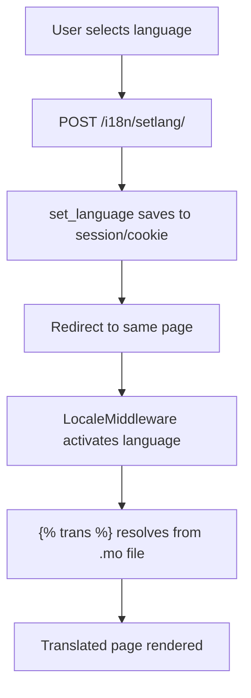

<div align="center">

# 🌐 GlobeLearn

### Django Internationalization Tutorial

**Server-side i18n · Dynamic language switcher · Step-by-step setup guide**

<br>



*Switch between **English**, **Latvian**, and **French** from the navbar — no extra packages required.*

<br>

[](https://python.org)
[](https://djangoproject.com)
[](#supported-languages)

</div>

---

## What you'll learn

- Configure Django i18n from scratch
- Mark strings for translation (`` and `gettext`)
- Extract and compile `.po` / `.mo` translation files
- Build a **dynamic language dropdown** that reads from `settings.py`
- Switch languages instantly without a submit button
- Add new languages in the future with minimal changes

---

## Quick start

```bash
cd djInternationlaization
python -m venv venv
venv\Scripts\activate        # Windows  |  source venv/bin/activate (macOS/Linux)
pip install django
python manage.py compilemessages
python manage.py runserver
```

Open **http://127.0.0.1:8000/** and use the language dropdown in the navbar.

**Expected output:**

```
$ python manage.py compilemessages
processing file django.po in .../locale/lv/LC_MESSAGES
processing file django.po in .../locale/fr/LC_MESSAGES

$ python manage.py runserver
Starting development server at http://127.0.0.1:8000/
Quit the server with CTRL-BREAK.
```

---

## Project structure

```
djInternationlaization/
├── manage.py
├── djInternationlaization/
│   ├── settings.py          # i18n configuration
│   └── urls.py              # includes set_language URL
├── interenationalization/
│   ├── views.py
│   ├── urls.py
│   └── locale/
│       ├── en/LC_MESSAGES/
│       ├── lv/LC_MESSAGES/  # Latvian translations
│       └── fr/LC_MESSAGES/  # French translations
├── templates/
│   ├── base.html            # navbar + dynamic language switcher
│   └── home.html            # tutorial content + setup guide
├── static/css/main.css
└── docs/screenshots/
    └── preview.png          # full-page screenshot (above)
```

---

## Full setup guide

Follow these steps to build this exact setup from scratch.

### Step 1 — Create the Django project

```bash
python -m venv venv
venv\Scripts\activate

pip install django

django-admin startproject myproject .
python manage.py startapp myapp
```

### Step 2 — Configure internationalization in `settings.py`

```python
INSTALLED_APPS = [
    ...
    'myapp',
]

MIDDLEWARE = [
    'django.middleware.security.SecurityMiddleware',
    'django.contrib.sessions.middleware.SessionMiddleware',
    'django.middleware.locale.LocaleMiddleware',  # after SessionMiddleware
    'django.middleware.common.CommonMiddleware',
    ...
]

LANGUAGE_CODE = 'en'
USE_I18N = True

LANGUAGES = [
    ('en', 'English'),
    ('lv', 'Latvian'),
    ('fr', 'French'),
]

LOCALE_PATHS = [BASE_DIR / 'myapp/locale']
```

### Step 3 — Add the i18n context processor

Required so `LANGUAGES` and `LANGUAGE_CODE` are available in every template (powers the dynamic dropdown):

```python
# settings.py → TEMPLATES → OPTIONS → context_processors
'django.template.context_processors.i18n',
```

### Step 4 — Wire up the language-switch URL

Django ships a built-in `set_language` view:

```python
# urls.py (project root)
from django.urls import path, include

urlpatterns = [
    path('i18n/', include('django.conf.urls.i18n')),
    path('', include('myapp.urls')),
]
```

This exposes `/i18n/setlang/` (name: `set_language`).

### Step 5 — Mark strings for translation

**Templates:**

```django

<h1></h1>
```

**Python views:**

```python
from django.utils.translation import gettext as _
message = _("Hello, world!")
```

Only marked strings are extracted by `makemessages`.

### Step 6 — Build the dynamic language switcher

The dropdown loops over `LANGUAGES` from settings — **no hardcoded options**:

```django


<form method="post" action="">
  
  <input name="next" type="hidden" value="{{ request.get_full_path }}">

  
  <select name="language" onchange="this.form.submit()">
    
    <option value="{{ language.code }}"
      selected>
      {{ language.name_local }}
    </option>
    
  </select>
</form>
```

| Field | Purpose |
|-------|---------|
| `action=""` | POSTs to Django's built-in view |
| `name="language"` | Selected language code |
| `name="next"` | Redirect back to current page after switch |
| `onchange="this.form.submit()"` | Auto-submit on select — no button needed |
| `get_language_info_list` | Reads from `LANGUAGES` in settings dynamically |

### Step 7 — Extract and compile translation files

```bash
python manage.py makemessages -l lv
python manage.py makemessages -l fr
# edit myapp/locale/*/LC_MESSAGES/django.po
python manage.py compilemessages
```

**Example `.po` entry:**

```po
msgid "Build apps that speak"
msgstr "Créez des applications qui parlent"   # French
```

> **Windows note:** `makemessages` and `compilemessages` require GNU gettext tools.
> Install from [GnuWin32](http://gnuwin32.sourceforge.net/packages/gettext.htm) or use WSL.

### Step 8 — Add a new language in the future

Only three steps — the navbar updates automatically:

```python
# 1. Add to settings.py
LANGUAGES = [
    ...
    ('de', 'German'),
]
```

```bash
# 2. Extract, translate, compile
python manage.py makemessages -l de
python manage.py compilemessages
# 3. Done — German appears in the navbar automatically
```

### Step 9 — Request flow



---

## How LocaleMiddleware picks the language

On every request, Django checks (in order):

1. **Session** — `django_language` key (set by `set_language` view)
2. **Cookie** — language preference cookie
3. **Accept-Language header** — browser default
4. **LANGUAGE_CODE** — fallback from settings (`en`)

---

## Key settings reference

| Setting | Value | Purpose |
|---------|-------|---------|
| `USE_I18N` | `True` | Enable translation system |
| `LANGUAGE_CODE` | `'en'` | Default language |
| `LANGUAGES` | `[('en', 'English'), ...]` | Supported languages |
| `LOCALE_PATHS` | `[BASE_DIR / 'app/locale']` | Where `.po`/`.mo` files live |
| `LocaleMiddleware` | in `MIDDLEWARE` | Activates language per request |
| `i18n` context processor | in `TEMPLATES` | Exposes `LANGUAGES` to templates |

---

## Useful commands

```bash
python manage.py makemessages -l lv -l fr   # extract strings
python manage.py compilemessages            # compile all
python manage.py compilemessages -l fr      # compile one language
python manage.py runserver
```

---

## Supported languages

| Code | Language | Native name |
|------|----------|-------------|
| `en` | English | English |
| `lv` | Latvian | Latviešu |
| `fr` | French | Français |

To add more, see **Step 8** above.

---

## Tech stack

- **Python 3.11+**
- **Django 5.2** (built-in i18n — no extra packages)
- Plain HTML/CSS (no frontend framework)
- GNU gettext for translation file management

---

## License

This is a tutorial project — use it freely for learning and teaching.
